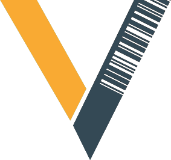

<p align="center"><a href="https://vladimir.rdfmis.ph" target="_blank"></a> </p>

[//]: # (<p align="center">)

[//]: # (<a href="https://travis-ci.org/laravel/framework"></a>)

[//]: # (<a href="https://packagist.org/packages/laravel/framework"></a>)

[//]: # (<a href="https://packagist.org/packages/laravel/framework"></a>)

[//]: # (<a href="https://packagist.org/packages/laravel/framework"></a>)

[//]: # (</p>)

# Vladimir: Asset Inventory Management System

Vladimir is a fixed asset management system that is used to track and monitor fixed assets using the barcoding method. It uses barcode labels and a barcode scanner for checking the inventory status. This system can be used to improve accuracy, reduce costs and keep up-to-date records of the company’s fixed assets.

## Highlighted Features

### Dynamic Inventory Management ✨

Say good-bye to cumbersome spreadsheets and errors. Vladimir automates inventory tracking, offering features like real-time monitoring, status updates, and location tracking. It's designed to keep your asset management smooth and stress-free.

### Streamlined Asset Acquisition 🚀

Recording new acquisitions has never been easier. Update your inventory, keep tabs on all asset details, and ensure everything stays historically accurate. Vladimir's asset acquisition feature revolutionizes your purchasing process and helps make informed decisions.

### Sophisticated Depreciation Tracking 📉

With support for various depreciation methods, Vladimir allows you to accurately compute the depreciation of assets over time. It gives you an edge in financial reporting and simplifies the process of tax calculations.

### Customized Reporting Dashboard 📊

Vladimir offers a customized reporting dashboard with a wealth of reports at your fingertips. It includes asset valuation, usage, maintenance costs, and disposal reports. Leverage this information to make impactful business decisions and strategize more effectively.

### Seamless User Experience 🌟

Vladimir delivers a seamless and efficient user experience, ensuring smooth navigation through an intuitively designed interface. You won't need a manual to handle operations; Vladimir is designed to be self-explanatory and convenient.

## Installation 🖥️

Follow the steps below to install the Vladimir Asset Inventory Management System.

1. **Clone the Repository**

   You first need to clone the repository to your local machine. Use the command below to clone the repository using HTTPS:

   ```bash
   git clone https://github.com/[YourGithubUsername]/Vladimir.git
   ```

2. **Navigate to the Project Directory**

   Once the repository is cloned, navigate to the project directory:

   ```bash
   cd Vladimir
   ```

3. **Install the Dependencies**

   Next, you need to install all the necessary dependencies. Vladimir is built on PHP, so you need [Composer](https://getcomposer.org/download/) (a tool for dependency management in PHP).

   Install dependencies via Composer:

   ```bash
   composer install
   ```

4. **Set up the Environment Variables**

   Copy the `.env.example` file, and rename it to `.env`. Update the environment variables in the `.env` file according to your configuration.

   ```bash
   cp .env.example .env
   ```

5. **Generate an App Key**

   PHP application needs an app key for encryption and other operations. You can generate the key using the following command:

   ```bash
   php artisan key:generate
   ```

6. **Run the Application**

   Finally, you can run the application using PHP's built-in server:

   ```bash
   php artisan serve
   ```
   You can now navigate to `http://localhost:8000` (or whatever port you have configured) in your web browser to see the application live.

_Note: Installation steps can vary depending on the specific configurations, modules, and dependencies of your project._

